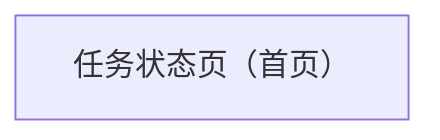

## 1. Product Overview
每天早上 8:00 自动抓取全网“宁德时代/小米”最新消息，按“上次成功时间点”做增量去重整理成邮件并发送到指定邮箱。
面向需要每天高效获取两家公司动态的个人/团队，减少手动检索与整理成本。

## 2. Core Features

### 2.1 Feature Module
本产品最小可用版本包含以下页面：
1. **任务状态页（首页）**：运行状态概览、上次成功时间点、最近一次抓取结果（增量/去重统计）、最新消息列表（用于核对邮件内容）。

### 2.3 Page Details
| Page Name | Module Name | Feature description |
|---|---|---|
| 任务状态页（首页） | 运行状态概览 | 展示今日计划执行时间（每天 8:00）、当前运行状态（空闲/运行中/失败）、最近一次执行时间与结果摘要。 |
| 任务状态页（首页） | 增量依据展示 | 展示“上次成功时间点（last_success_at）”与本次抓取的时间窗口（从 last_success_at 到现在）。 |
| 任务状态页（首页） | 去重与产出统计 | 展示本次新增消息数量、去重命中数量、最终邮件条目数量。 |
| 任务状态页（首页） | 最新消息列表 | 列表展示本次输出的消息：标题、来源、发布时间、跳转链接；用于快速核对邮件内容。 |
| 任务状态页（首页） | 邮件发送结果 | 展示发送目标邮箱、发送时间、发送状态（成功/失败）与失败原因（如有）。 |

## 3. Core Process
- 每天早上 8:00（定时任务触发）开始执行抓取任务。
- 系统读取“上次成功时间点 last_success_at”。
- 系统从多个可用信息源抓取与“宁德时代/小米”相关的最新消息，并只保留发布时间晚于 last_success_at 的内容。
- 系统对抓取结果进行去重（同一链接/同一内容哈希视为重复），得到“本次新增消息集合”。
- 系统将新增消息整理为邮件正文（按公司分组，包含标题、来源、发布时间、链接），发送到指定邮箱。
- 邮件发送成功后，系统将 last_success_at 更新为“本次任务完成时间”，以支持下次增量。

