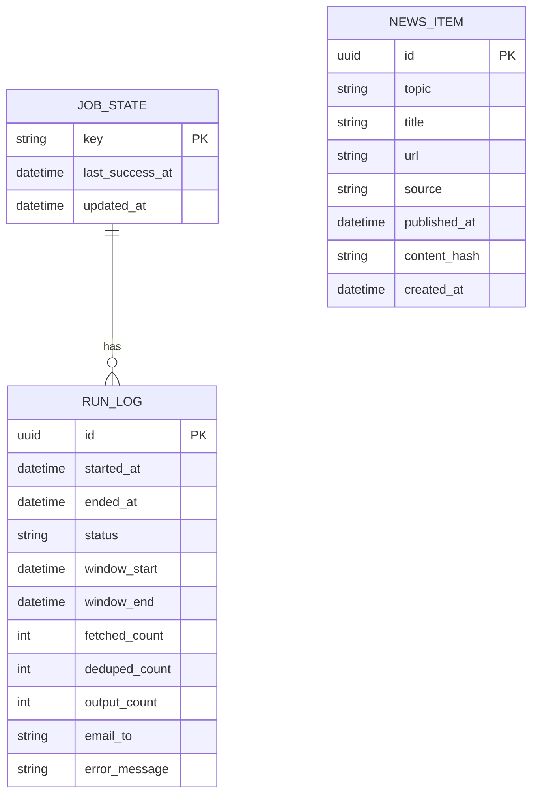

## 1.Architecture design
```mermaid
graph TD
  A["User Browser"] --> B["Next.js (React) Frontend"]
  B --> C["Next.js API Routes (Vercel Functions)"]
  D["Vercel Cron Jobs"] --> C
  C --> E["Supabase SDK"]
  E --> F["Supabase (Postgres)"]
  C --> G["Email Provider (Resend API)"]

  subgraph "Frontend Layer"
    B
  end

  subgraph "Backend Layer (Serverless on Vercel)"
    C
  end

  subgraph "Service Layer"
    F
    G
  end
end
```

## 2.Technology Description
- Frontend: Next.js (React@18) + TypeScript + tailwindcss
- Backend: Next.js API Routes (Vercel Serverless Functions) + Vercel Cron Jobs
- Database: Supabase (PostgreSQL)
- Email: Resend API（需要配置 RESEND_API_KEY 与发件域名/地址）

## 3.Route definitions
| Route | Purpose |
|---|---|
| / | 任务状态页：展示 last_success_at、本次增量结果、最新消息与邮件发送结果 |
| /api/health | 健康检查：用于确认服务可用 |
| /api/cron/daily | 被 Vercel Cron 调用：执行抓取→增量→去重→组装邮件→发送→写入状态 |

## 4.API definitions (If it includes backend services)
### 4.1 Core Types (TypeScript)
```ts
export type Topic = "CATL" | "XIAOMI";

export type NewsItem = {
  id: string;
  topic: Topic;
  title: string;
  url: string;
  source: string;
  publishedAt: string; // ISO
  contentHash: string;
  createdAt: string; // ISO
};

export type JobState = {
  key: "daily_news";
  lastSuccessAt: string | null; // ISO
  updatedAt: string; // ISO
};

export type RunLog = {
  id: string;
  startedAt: string; // ISO
  endedAt: string | null; // ISO
  status: "SUCCESS" | "FAILED" | "RUNNING";
  windowStart: string | null; // ISO
  windowEnd: string | null; // ISO
  fetchedCount: number;
  dedupedCount: number;
  outputCount: number;
  emailTo: string;
  errorMessage: string | null;
};
```

### 4.2 Endpoints
#### POST /api/cron/daily
用途：执行每天 8:00 的抓取与邮件发送。
- Auth：仅允许定时任务调用（建议用 Header 共享密钥，例如 CRON_SECRET）。

Response（成功）：
```json
{
  "status": "SUCCESS",
  "windowStart": "2026-02-25T00:00:00.000Z",
  "windowEnd": "2026-02-26T00:00:00.000Z",
  "outputCount": 18
}
```

## 5.Server architecture diagram (If it includes backend services)
```mermaid
graph TD
  A["/api/cron/daily"] --> B["Controller (Route Handler)"]
  B --> C["Service: Fetch & Normalize"]
  B --> D["Service: Incremental Filter"]
  B --> E["Service: Dedup"]
  B --> F["Service: Compose Email"]
  B --> G["Service: Send Email"]
  B --> H["Repo: Supabase Access"]
  H --> I["Supabase (Postgres)"]

  subgraph "Vercel Function"
    B
    C
    D
    E
    F
    G
    H
  end
end
```

## 6.Data model(if applicable)
### 6.1 Data model definition


### 6.2 Data Definition Language
Job State (job_state)
```sql
CREATE TABLE job_state (
  key TEXT PRIMARY KEY,
  last_success_at TIMESTAMPTZ NULL,
  updated_at TIMESTAMPTZ NOT NULL DEFAULT NOW()
);

INSERT INTO job_state (key, last_success_at) VALUES ('daily_news', NULL)
ON CONFLICT (key) DO NOTHING;

GRANT SELECT ON job_state TO anon;
GRANT ALL PRIVILEGES ON job_state TO authenticated;
```

Run Log (run_log)
```sql
CREATE TABLE run_log (
  id UUID PRIMARY KEY DEFAULT gen_random_uuid(),
  started_at TIMESTAMPTZ NOT NULL DEFAULT NOW(),
  ended_at TIMESTAMPTZ NULL,
  status TEXT NOT NULL,
  window_start TIMESTAMPTZ NULL,
  window_end TIMESTAMPTZ NULL,
  fetched_count INT NOT NULL DEFAULT 0,
  deduped_count INT NOT NULL DEFAULT 0,
  output_count INT NOT NULL DEFAULT 0,
  email_to TEXT NOT NULL,
  error_message TEXT NULL
);

CREATE INDEX idx_run_log_started_at_desc ON run_log (started_at DESC);

GRANT SELECT ON run_log TO anon;
GRANT ALL PRIVILEGES ON run_log TO authenticated;
```

News Items (news_item)
```sql
CREATE TABLE news_item (
  id UUID PRIMARY KEY DEFAULT gen_random_uuid(),
  topic TEXT NOT NULL,
  title TEXT NOT NULL,
  url TEXT NOT NULL,
  source TEXT NOT NULL,
  published_at TIMESTAMPTZ NOT NULL,
  content_hash TEXT NOT NULL,
  created_at TIMESTAMPTZ NOT NULL DEFAULT NOW()
);

CREATE UNIQUE INDEX uq_news_item_url ON news_item (url);
CREATE UNIQUE INDEX uq_news_item_content_hash ON news_item (content_hash);
CREATE INDEX idx_news_item_published_at_desc ON news_item (published_at DESC);

GRANT SELECT ON news_item TO anon;
GRANT ALL PRIVILEGES ON news_item TO authenticated;
```

